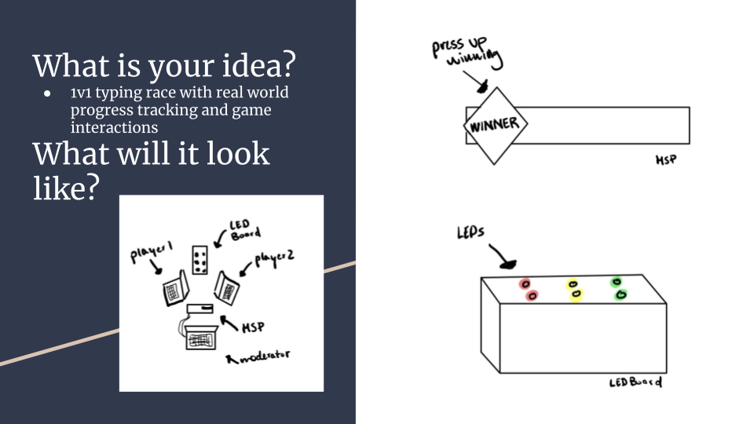

# actuated-1v1-typing

### Description

Actuated-1v1-typing is an IoT system that physicalizes competition. It is a two-player game where each player types the same workset at the same time; meanwhile there is a motorized slized potentiometer and vibration motor indicating the progress of the game, and how often each player makes mistakes. The player who finishes the workset first wins the game, which is denoted by the slide potentiometer at the end.

### Codebase Description

`arduino-controller/`

DESCRIPTION: this folder contains the code for the Arduino Uno that controls the vibration motor and slide potentiometer it connected to.

SKILLS: C++, Adruino

`serial-interface/`

DESCRIPTION: this folder acted as connection between the Arduino and the computer that hosts the game.

SKILLS: Typescript, Websockets, Serial Ports

`typing-1v1-server/`

DESCRIPTION: this folder is responsible for all the game logic and opening up REST endpoints.

SKILLS: Typescript, Websockets, REST, Express.js

`typing-client/`

DESCRIPTION: this folder is responsible for the client-side of the game, displaying the UI, and making calls to the server.

SKILLS: Typescript, React.js, REST, Design :)

### Sensors Used

1. Keyboard
2. Slide Potentiometer

### Actuators Used

1. Vibration Motor
2. Slide Potentiometer

### Demo Video

Click [here](https://youtu.be/JqVK_WTDmEQ) to watch the demo video.
